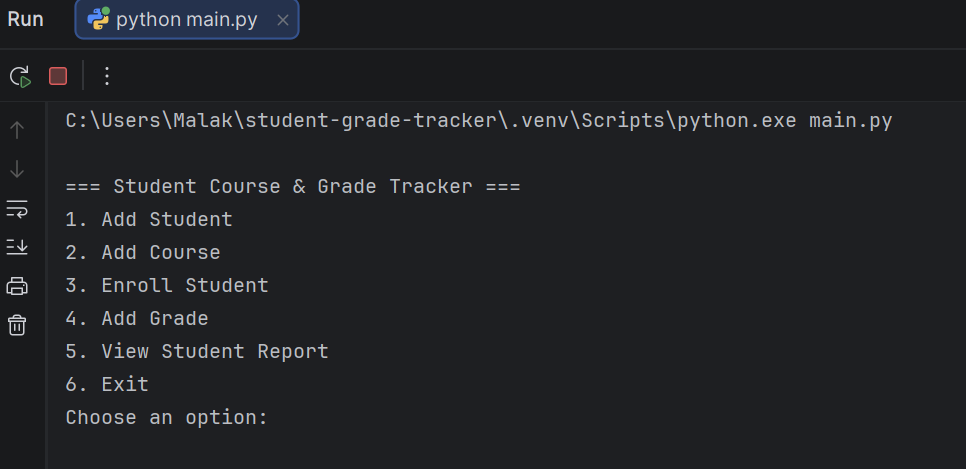
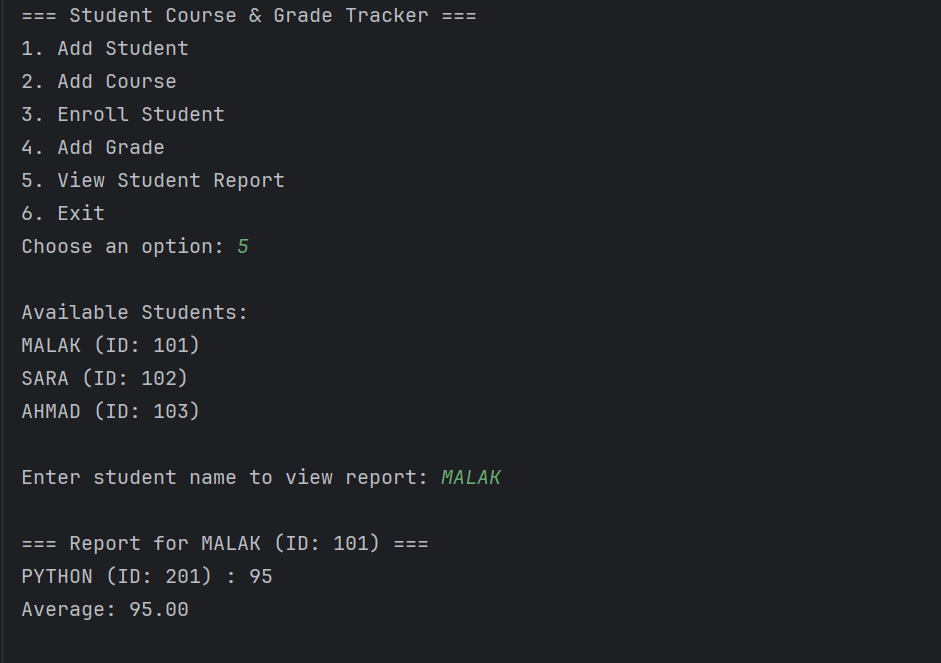

# Student Course & Grade Tracker
A simple Python console application to manage students, courses, enrollments, and grades.

## Features
- Add student
- Add course
- Enroll student in a course
- Add grade
- View student report
- Calculate average grade

## Technologies Used
- Python
- Text file handling
- Functions
- Loops and conditionals
- Input validation

## Project Files
- main.py
- students.txt
- courses.txt
- enrollments.txt
- grades.txt
- README.md

## Screenshots

### Main Menu


### Student Report


## How to Run
```bash
python main.py

ط
